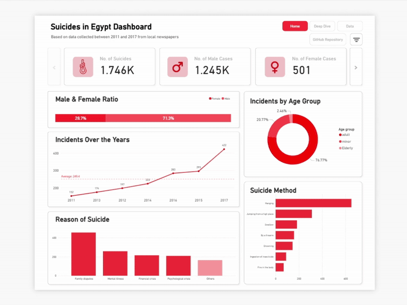
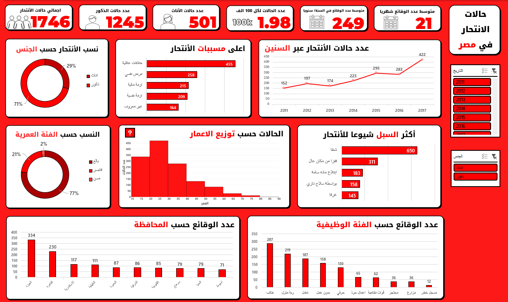

# Suicides in Egypt Dashboard



## Project Overview

This is a comprehensive analytical dashboard developed as part of the **DEPI (Digital Egypt Pioneer Initiative)** graduation project. The dashboard provides in-depth analysis of suicide incidents in Egypt based on data collected from local newspapers between 2011 and 2017.


**Tools & Technologies:**
- Power BI
- Excel
- Python
- SQL

---

## 1. Data Preprocessing & Transformation (The Technical Backend)

The raw dataset was originally in Arabic and required a comprehensive pipeline of translation, cleaning, and feature engineering before analysis could begin.

### 1.1 Translation (Python)

The dataset was translated from Arabic to English using the `googletrans` library. This process involved translating both column names and cell values while handling potential API rate limits and errors.

```python
from googletrans import Translator
import time
import pandas as pd

translator = Translator()

def safe_translate(text, src='ar', dest='en', max_retries=3, pause=0.3):
    """
    Safely translate text with retry logic to handle API limitations.
    
    Parameters:
    - text: The text to translate
    - src: Source language (default: Arabic)
    - dest: Destination language (default: English)
    - max_retries: Number of retry attempts
    - pause: Wait time between retries
    """
    if pd.isna(text):
        return text
    s = str(text)
    for i in range(max_retries):
        try:
            return translator.translate(s, src=src, dest=dest).text
        except Exception:
            time.sleep(pause * (i + 1))
    return s  # Return original text if all retries fail

# Translate column names
col_map = {col: safe_translate(col) for col in df.columns}
df.rename(columns=col_map, inplace=True)

# Translate cell values for specific columns
# (Additional cleaning logic applied here)
```

### 1.2 Data Cleaning (Power Query)

After translation, **Power Query** in Power BI was used to:
- Fix translation inconsistencies and errors
- Replace generic values like "Unavoidable" and "unknown" with standardized categories (e.g., "Others")
- Remove duplicate or incomplete records
- Standardize governorate names and other categorical values
- Handle missing values appropriately

### 1.3 Feature Engineering (SQL)

A "Season" column was engineered based on the incident date to enable seasonal analysis. This was implemented using SQL logic to categorize dates into meteorological seasons.

```sql
SELECT 
    index,
    CASE 
        -- Winter: December 21 - March 20
        WHEN (EXTRACT(MONTH FROM history_of_the_incident) = 12 AND EXTRACT(DAY FROM history_of_the_incident) >= 21)
            OR EXTRACT(MONTH FROM history_of_the_incident) IN (1, 2)
            OR (EXTRACT(MONTH FROM history_of_the_incident) = 3 AND EXTRACT(DAY FROM history_of_the_incident) <= 20)
        THEN 'Winter'
        
        -- Spring: March 21 - June 20
        WHEN (EXTRACT(MONTH FROM history_of_the_incident) = 3 AND EXTRACT(DAY FROM history_of_the_incident) >= 21)
            OR EXTRACT(MONTH FROM history_of_the_incident) IN (4, 5)
            OR (EXTRACT(MONTH FROM history_of_the_incident) = 6 AND EXTRACT(DAY FROM history_of_the_incident) <= 20)
        THEN 'Spring'
        
        -- Summer: June 21 - September 20
        WHEN (EXTRACT(MONTH FROM history_of_the_incident) = 6 AND EXTRACT(DAY FROM history_of_the_incident) >= 21)
            OR EXTRACT(MONTH FROM history_of_the_incident) IN (7, 8)
            OR (EXTRACT(MONTH FROM history_of_the_incident) = 9 AND EXTRACT(DAY FROM history_of_the_incident) <= 20)
        THEN 'Summer'
        
        -- Autumn: September 21 - December 20
        WHEN (EXTRACT(MONTH FROM history_of_the_incident) = 9 AND EXTRACT(DAY FROM history_of_the_incident) >= 21)
            OR EXTRACT(MONTH FROM history_of_the_incident) IN (10, 11)
            OR (EXTRACT(MONTH FROM history_of_the_incident) = 12 AND EXTRACT(DAY FROM history_of_the_incident) <= 20)
        THEN 'Autumn'
    END AS season
FROM suicides_in_egypt;
```

---

## 2. Power BI Dashboard Overview

The Power BI dashboard consists of three interactive pages, each designed to provide different levels of analytical depth.

### Page 1: Home (High-Level Overview)

The home page provides a comprehensive snapshot of the overall suicide situation in Egypt during the analyzed period.

**Key Visuals:**

- **KPI Cards:** Display the total number of suicide incidents and breakdown by gender (male vs. female cases). These metrics are calculated using DAX measures to ensure dynamic filtering capabilities.

- **Male & Female Ratio:** A 100% stacked bar chart that visualizes the proportional distribution between genders, making it easy to identify gender-based patterns.

- **Incidents Over the Years:** A line chart illustrating the temporal trend of incidents across the analysis timeline, helping identify whether incidents are increasing, decreasing, or remaining stable over time.

- **Incidents by Age Group:** A donut chart showing the distribution of cases across broad age categories (e.g., Adults, Minors, Elderly), providing insights into which age demographics are most affected.

- **Reason of Suicide:** A vertical bar chart ranking the primary reported causes of suicide, such as family disputes, mental illness, financial crises, and psychological issues, enabling stakeholders to understand the main contributing factors.

- **Suicide Method:** A horizontal bar chart highlighting the most common methods used, which can inform prevention strategies and policy interventions.

### Page 2: Deep Dive (Detailed Analysis)

This page offers more granular analysis for users who want to explore specific dimensions of the data.

**Key Visuals:**

- **Incidents by Occupation:** A horizontal bar chart comparing incident counts across different functional categories and occupations (e.g., students, housewives, workers, craftsmen), revealing vulnerable occupational groups.

- **Incidents by Region (Map):** A choropleth map of Egypt visualizing geographical hotspots where incidents are concentrated. 
  
  **Technical Note:** This visual uses a custom **Shape Map** created by importing a TopoJSON file that accurately renders Egyptian governorate boundaries, ensuring proper geographical representation.

- **Age Distribution (Python Visual):** A detailed histogram showing the frequency distribution of suicides by specific age values, providing more precision than the age group categories.
  
  **Technical Note:** This visualization was created using an embedded Python script within Power BI:
  
  ```python
  import matplotlib.pyplot as plt
  import seaborn as sns

  # Set visual styling
  sns.set(font="Bahnschrift", font_scale=1)
  plt.figure(figsize=(10, 5))
  plt.gca().set_facecolor("#ffffff")

  # Create histogram
  sns.histplot(
      data=dataset, 
      x='the age', 
      bins=15, 
      color="#f63636", 
      edgecolor="#f63636", 
      alpha=0.9
  )

  # Customize labels and styling
  plt.xlabel('Age', fontsize=14, color='grey')
  plt.ylabel('Number of Cases', fontsize=14, color='grey')
  plt.tick_params(colors='grey')
  plt.grid(axis='y', alpha=0.3)
  
  # Display the plot
  plt.show()
  ```

- **Incidents by Season:** A Tree Map or heatmap-style visual displaying the density of incidents across the four meteorological seasons (Winter, Spring, Summer, Autumn), utilizing the SQL-engineered season column to reveal potential seasonal patterns.

### Page 3: Data & Exploration

This page provides interactive exploration capabilities and raw data access.

**Key Features:**

- **Decomposition Tree:** An AI-powered interactive visual that allows users to hierarchically drill down through the data by selecting different categorical levels:
  1. **Gender** (Male/Female)
  2. **Age Group** (Adult/Minor/Elderly)
  3. **Territories** (Delta governorates/Central governorates/Upper Egypt governorates/Border governorates/Canal cities)
  4. **The incident governorate** (Specific governorate names)
  
  This enables users to perform root cause analysis by exploring how different demographic and geographic factors interact.

- **Data Table:** A comprehensive tabular view of the complete dataset, allowing users to inspect individual records, apply filters, and export data for further analysis.

---

## 3. Excel Dashboard

In addition to the Power BI dashboard, this project includes a separate **Excel Dashboard** for users who prefer working in the Excel environment. The Excel dashboard provides similar analytical insights using Excel's native charting and pivot table capabilities.

The Excel dashboard file can be found in the project repository.

### Excel Dashboard Preview




---

## Key Insights & Findings

This dashboard enables stakeholders to:
- Identify temporal trends in suicide incidents
- Understand demographic patterns (age, gender, occupation)
- Discover geographical hotspots requiring intervention
- Analyze root causes and contributing factors
- Develop targeted prevention strategies based on data-driven insights

---

## Contributors

This project was developed as part of the **DEPI (Digital Egypt Pioneer Initiative)** program.

**Team Members:**
- Sulaiman Mohammed Dawood
- Ahmed Osama
- NourAllah Ashraf Kamal
- Shahd Ahmed Fouad
- Mohamed Hussein Mohamed Ali

---

## Acknowledgments

- Data sourced from local Egyptian newspapers (2011-2017)
- Special thanks to the DEPI program instructors and mentors
- Python libraries: `googletrans`, `pandas`, `matplotlib`, `seaborn`
- Power BI community for custom visual resources

---

## Contact

For questions or feedback, please open an issue in this repository or contact the project maintainers.
